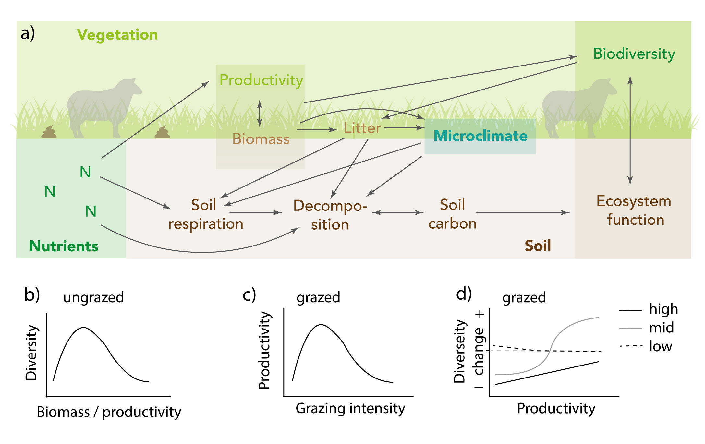

```{r setup, include=FALSE}
knitr::opts_chunk$set(echo = FALSE, eval = TRUE, warning = TRUE)
library(drake)
library(tidyverse)
library(DiagrammeR)
library(glue)
library(kableExtra)

```


## INTRODUCTION

Alpine and Arctic ecosystems cover approximately 40% of the Earth land surface, contain high biodiversity and a variety of ecosystem functions and services such as water, soil, and nutrient retention and regulation, carbon sequestration and storage, grazing areas for wildlife and livestock and cultural and recreational services [@Korner2005-or].
Grasslands in cold ecosystems are often semi-natural and have been managed for grazing and fodder production for centuries.
These grasslands can be species rich in vascular plants due to their evolutionary history, specific abiotic conditions and land-use management [@Poschlod1998-iy; @Merunkova2012-xg].
Due to low temperatures in these ecosystem, processes such as decomposition and respiration are slow resulting in potentially important carbon sinks [@Kato2004-fa; @Schimel2002-en].
Traditional land-use such as grazing (including both wildlife and livestock) and mowing has drastically changed during the last century to either increased intensification or abandonment and the implications for biodiversity and ecosystem functioning are diverse.


Grazing and mowing directly or indirectly affect vegetation, nutrient cycle, microclimate and soil in similar ways (except for additional nutrients and trampling for grazing) with impacts on biodiversity and ecosystem functioning [Figure \@ref(fig:diagram)a, @Wardle2004-ym].
Biodiversity in grasslands is influenced by plant productivity and biomass, and in an undisturbed vegetation, this relationship is hump-shaped [Figure \@ref(fig:diagram)b; @Noy-Meir1975-wn].
To a certain threshold, higher productivity increases the amount of biomass, which generates a positive feedback to plant productivity, however beyond this threshold, the relationship reverses.
In a grazed or mowed system, biomass is constantly removed, while grazing also affects productivity via nutrient input (i.e. dung and urine).
The relationship between grazing and productivity is non-linear and often highest productivity is reached at an intermediate grazing level [Figure \@ref(fig:diagram)c, @McNaughton1979-ya; @Milchunas1993-ts; @Austrheim2014-hf; @Austrheim2016-zd].
At a low grazing intensity, relative to productivity, competitive exclusion leads to dominance by a few species, whereas under very high grazing intensity, again relative to productivity, too much biomass is removed to the point where a system is degraded or reaches a tipping point [@Grime1973-ju; @Odriozola2017-uf].
<!-- Find a ref for a low productive system. Odriozola is for high productive -->
The effect of grazing on biodiversity is however context-dependent, where both the intensity of grazing and the productivity of the system are important [Figure \@ref(fig:diagram)d, @Bernes2015-yg; @Collins1998-oz].
Colder and nutrient-poor ecosystems often support low-productivity plant communities with little biomass, but which are often relatively species rich [@Grime1973-ju; @Milchunas1993-ts].
Such communities are usually characterised by facilitative species interactions [@Bertness1994-cx] and consequently have a positive relationship between biomass and species diversity (Figure \@ref(fig:diagram)b, left side of graph).
In such systems, a reduction in biomass, for example via grazing, will result in a decrease in biodiversity [@Choler2001-ak; @Bernes2015-yg].
More productive plant communities will result in increased competition for light among species and lower species diversity [Figure \@ref(fig:diagram)b, right side of graph, @Grime1973-ju; @Collins1998-oz; @Bernes2015-yg].
Removal of biomass in a productive system can therefore be positive for biodiversity and the net effect of grazing on biodiversity will therefore switch along a productivity gradient.


```{r diagram, fig.cap = "Impact of grazing on the vegetation and soil. a) Pathways of the effect of grazing on vegetation, nutrient cycling, microclimate and soil with impacts on biodiversity and ecosystem carbon fluxes. b) Relationship between biomass/productivity and diversity in an ungrazed grassland. c) Relationship between grazing intensity and diversity. d) Impact of grazing intensity and habitat productivity on diversity.", out.width = '100%'}



```


Grazing and mowing also affect the soil structure and soil processes such as decomposition, soil respiration and soil carbon stocks which are linked to the carbon cycle (Figure \@ref(fig:diagram)a).
Directly grazers impact the soil via nutrient input or trampling (not considered in this study) and indirectly by removal of biomass, leading to change in vegetation structure, composition, affecting litter input, and microclimate [@Zeeman2010-ku].
Grazers directly increase nutrient availability in the soil, which can accelerate processes such as decomposition or soil respiration [@Frank2000-lh].
Indirectly, the loss of photosynthetic tissue by grazing or mowing (i.e. decrease in Leaf Area Index; LAI) can reduce the carbon acquisition [@Owensby2006-bq; @Schmitt2010-au].
Removal of biomass can also change the amount and quality of litter that enters the soil and thus indirectly change the decomposition rate [@Sjogersten2011-so; @Olofsson2004-fu; @Semmartin2004-qb] and the amount of carbon added to the soil [@Martinsen2011-qe; @Sun2011-hw].
As a response to grazing and/or mowing, plants can change their biomass allocation from shoots to roots or vice versa affecting the amount of carbon stored in the soil [@Frank2002-nr; @Archer1983-od].
<!-- Positive effect of grazing on soil C: Bardgett RD, Wardle DA, Yeates GW (1998) Linking above-ground and below-ground interactions: how plant responses to foliar herbivory influence soil organisms. Soil Biology and Biochemistry, 30, 1867–1878. -->
<!-- Reeder JD, Schuman GE (2002) Influence of livestock grazing on C sequestration in semi-arid mixed-grass and short-grass rangelands. Environmental Pollution, 116, 457–463. -->
The removal of biomass also alters the microclimate such as ground and soil temperature and soil moisture [@Klein2005-lt; @Shao2012-zo; @Olofsson2004-fu], which can accelerate or slow down processes in the soil.
Finally, land-use history is important for how much carbon has been accumulated in the soil and carbon effluxes [@Welker2004-hp; @Ylanne2019-ha].
Grazing and mowing thus affect the carbon cycle in multiple ways, and often carbon gas effluxes increase with grazing due to higher soil carbon, better microclimatic conditions for respiration [@Zhang2015-vb; @Jun2008-lc; @Gao2009-mt; @Sagar2019-ks], but not always [@Welker2004-hp].
Similarly, to the impacts aboveground, grazing intensity and the environmental context, i.e. the productivity and climate are important [@McSherry2013-wa; @Tang2019-bd].
High grazing intensity has been shown to have a negative impact on the acquisition of soil carbon in low productive systems (e.g. dominated by C3 grasses) [@McSherry2013-wa; @Steffens2008-pu; @Golluscio2009-xp], however opposite patterns have been explained by shifts in plant species composition and increased allocation in root biomass [@Gao2009-mt].
An intermediate grazing level can have a positive effect on carbon cycling by increasing soil carbon stocks [@Martinsen2011-qe; @Lu2017-gf; @Austrheim2016-zd].
Precipitation can increase carbon sequestration [@Tang2019-bd], however evidence from regions with high precipitation are missing (MAP > 1000 mm).
<!-- This study was from MAP < 1000mm -->
The interplay between grazing and/or mowing intensity and ecosystem productivity on the carbon cycle are complex and not well understood.

<!-- There's also trampling effects from large grazers...will you mention it as an alternative? https://doi.org/10.1016/j.agee.2017.10.023 -->


Grazing and/or mowing impact the vegetation or soil processes simultaneously, however they are usually studied separately [but see @Sagar2019-ks; @Austrheim2016-zd].
Functional diversity, by using plant functional traits is one way to link environmental drivers and plant responses to ecosystem functioning [@Diaz2001-yz; @Lavorel2007-ua].
(Need a transition here...)
Grazing can reduce plant height, leaf area (i.e. smaller area for foraging) and leaf dry matter content (i.e. tougher leaves), reflecting a grazing avoidance strategy [@Hui2014-am], and can result in lower carbon acquisition in the plants (ref).
Alternatively, grazing can stimulate plant growth (i.e. increased specific leaf area and turnover) and fresh leaves are more efficient in carbon uptake [@Owensby2006-bq].
Thus, plant functional traits in response to grazing and/or mowing reflect a trade-off between the resource acquisition spectrum and a response to grazing.


Global change is profoundly impacting cold ecosystems and warmer climate and nitrogen addition are two key drivers [@Pacifici2015-il; @Ipcc2014-fj; @Ipbes2018-hg].
They act at larger spatial and temporal scales compared to grazing and mowing, but influence grassland biodiversity and ecosystem carbon cycling via similar pathways, i.e plant productivity, biomass, decomposition and soil respiration and carbon stocks.
They increase nutrients availability directly or indirectly by elongating the growing season and/or increasing photosynthetic activity.
Warming and nitrogen addition will therefore push a plant community towards more productive and competitive conditions, resulting in decreased biodiversity [@Humbert2016-wg; @Elmendorf2012-bz; @Klanderud2008-kj].
These drivers affect soil processes by increasing decomposition, soil respiration and sometimes accumulation of soil carbon [Gavazov2010-bz; @Althuizen2018-sf], which can result in higher ecosystem effluxes [@Jun2008-lc; @Zhang2015-vb].
However the net effect of these global change drivers also depend on soil moisture, the vegetation and consequently the quality of the litter [e.g. @Emmett2004-sk].
Overall, warming and nitrogen deposition pose a threat to alpine biodiversity and ecosystem functions and their combined effects with grazing are not well understood  [but see @Zhu2015-jw].


Several meta-analysis have synthesized the effects of grazing and/or mowing on plant diversity [@Herrero-Jauregui2018-dp; @Gao2020-xv; @Talle2016-go], productivity [@Yan2013-qt], soil carbon or soil quality [@Xiong2016-ra; @Lai2020-ti; @Zhan2020-ae] or carbon fluxes [@Tang2019-bd], focusing on grazing intensity [e.g. @Herrero-Jauregui2018-dp; @Yan2013-qt; @Zhan2020-ae], grazing exclusion [e.g. @Xiong2016-ra] or the difference between grazing and mowing [@Talle2016-go].
These studies focus on regional or global levels but we are not aware of any studying grazing and/or mowing intensity and productivity in alpine or arctic ecosystems [but see @Bernes2015-yg on impacts of reindeer in cold ecosystems].
Here, we conduct a meta analysis to estimate the effect of wildlife or livestock grazing and/or mowing on taxonomic or functional plant diversity and/or ecosystem carbon fluxes in alpine and arctic habitats.
We focus on the role of grazing and/or mowing intensity and ecosystem productivity, and additionally explore if this effect can be explained by methodology, grazer identity, duration and timing of the treatment, biomass, decomposition, soil carbon, and soil depth.
Specifically, we hypothesize that the interplay of grazing intensity and productivity define the net impact of grazing on biodiversity and ecosystem functioning.
The impact of grazing and/or mowing will be negative in low productive habitats, and switch to positive with increasing productivity, but also depend strongly on the intensity of grazing and/or mowing.
We hypothesize that an intermediate level of grazing/mowing is beneficial to maintain or increase biodiversity and soil carbon sequestration.
Finally, we are interested how these effects change in combination with warmer climate and/or nitrogen addition.
We hypothesize that warming and nitrogen addition will negatively impact biodiversity and ecosystem carbon fluxes, but grazing and/or mowing have the potential to mitigate those negative impacts [@Martinsen2011-qe; @Austrheim2016-zd; @Smith2015-wu].


## METHODS

We use a systematic approach to screen the literature in an unbiased and transparent way and use best practice protocols to quantify the magnitude of the outcome and assess the source of heterogeneity across studies [@Hillebrand2016-qo].


### Pilot study

We conducted a pilot study as recommended by Foo et al. [-@Foo2021-al], on the 26th November 2020 including literature search, title, abstract and full text screening and data extraction.
The pilot study helped finalizing the research question, select suitable search terms to reach an efficient hit rate (number of relevant studies during the screening process), defining the suitable inclusion and appraisal criteria, and relevant information and metrics for the data extraction as well as preparing the code to conduct the analyses and present the results.
We used 10 % of the papers from the full literature search in web of science to conduct the pilot study and extracted data from 1.2 % of the papers from the full search.


### Literature search

Relevant studies were searched (add date), using three academic literature databases: ISI Web of Science (https://webofknowledge.com/), Scopus (https://www.scopus.com/) and Agricola (https://agricola.nal.usda.gov/).
Each database was searched using the following Boolean search strings: (graz* *OR* ungraz* *OR* clip* *OR* mow* *OR* trim* *OR* cut* *OR* herbivor* *OR* defoliat* *OR* abandonment) **AND** (alpin* *OR* montane* *OR* mountain*OR* subalpine *OR* sub-alpine *OR* arctic *OR* tundra *OR* boreal) **AND** (grassland* *OR* meadow* *OR* pasture* *OR* herbfield*).
The search was restricted to English language search terms and included all research articles (i.e. excluding reviews) between 1945 and 2020.

The search terms were kept general to be inclusive and retrieve as many studies as possible that focused on grazing or mowing in alpine and arctic grassland ecosystems.
We therefore did not include the terms "diversity", "warming", "nitrogen addition" and "carbon flux" and screened all studies from the original search for relevant papers.

We checked the reference lists of review papers that came up in the same search for additional studies.


### Screening process

The original search resulted in 208 (note that these numbers are from the pilot study) unique articles (Figure \@ref(fig:roses)) after the removal of 5 duplicates.
A random selection of ca. 10% of the papers will be screened by two independent reviewers to check for consistency in the inclusion process.
We will conducted a kappa analysis, which assesses the agreement for decision between reviewers [@Pullin2006-si]. 
<!-- We (hopefully) found satisfactory agreement between the two reviewers (k = XXX). -->

```{r roses, fig.cap = "ROSES flow diagram for the systemtic literature search", out.width = '100%'}
  
#readd(roses_plot)
knitr::include_graphics("Roses.png")

```


The full-text of the remaining 75 studies were assessed against the following inclusion and appraisal criteria (Table \@ref(tab:criteria-table)).
Studies conducted in (a) natural or semi-natural alpine or arctic/tundra grasslands with a (b) grazing, mowing or clipping treatment and a control (no treatment) were included.
Studies also needed to report effects on (c.1) plant diversity (taxonomic or functional) and/or (c.2) ecosystem carbon fluxes using chamber measurements, biomass harvesting and/or soil sampling, number of replication and a measure of variance.
Finally, studies that included a global change treatment (d) such as warming and/or nitrogen addition were included, however this criteria was not mandatory because we are interested in the grazing/mowing treatment alone and in combination with warming and/or nitrogen addition.

```{r criteria-table, eval = FALSE}

make_criteria_tables() %>% 
  mutate(across(where(is.character), ~str_wrap(.x, width = 50))) %>%
  mutate(across(where(is.character), linebreak)) %>% 
  kbl(booktabs = TRUE,
      escape = FALSE,
      col.names = linebreak(c("Inclusion criteria", "Critical appraisal criteria"), align = "c"),
      caption = "Inclusion and appraisal criteria for the meta analysis.")


```


### Data extraction and moderators

From each study, we extracted data on the a) study location, b) study design, c) ecological and d) response variables (Table \@ref(tab:moderator-table)).
We hypotheses that the moderators a - c) have an effect on the response variables d).
For the response variables, we extracted the mean value for grazed/mowed (treatment) and control plots from each study site and if available also from the warming and nitrogen addition treatment.
We also retrieved number of replication per treatment and a measure of variance (i.e. standard deviation, standard error or variance) for studies with multiple replication and calculated standard deviation.
If the data was only available from figures, we used the R package metaDigitise to extract the data [@Pick2018-qv].


```{r moderator-table,eval=FALSE}

make_moderator_tables() %>% 
  kbl(booktabs = TRUE,
      caption = "Moderators and response variables for the meta analysis. The moderators are divided into a) study location, b) study design and c) ecological variables.") %>% 
  pack_rows("a) Study location", 1, 6) %>%
  pack_rows("b) Study design", 7, 23) %>%
  pack_rows("c) Ecological variables", 24, 28) %>%
  pack_rows("d) Response variables", 29, 30) %>%
  kable_styling(font_size = 15,
                 latex_options = c("scale_down")) %>% 
  footnote(symbol = c("Levels can also be NULL (does not apply) or NA (information is not available).")) %>% 
  landscape()

```


62 studies were excluded because they were conducted in the wrong type of habitat (e.g. boreal forest, coastal grasslands), there was no grazing treatment, no response variable, no measure of variance for the response variable, no data available or the paper was not found (for details see Figure \@ref(fig:roses)).
Information that was missing but could be retrieved otherwise was added to the dataset, i.e. coordinates from site names and maps and grassland type from other papers.
Mean annual temperature and annual precipitation for each sites was extracted using the CHELSEA climate database [@Karger2017-so].

For studies that were conducted at more than one site (e.g. along environmental gradients) or over several years, we included all sites, but treated each site as independent record and used only the last year of data collection.


### Calculation of the effect size

The meta analysis was conducted separately for the two response variables plant species diversity and ecosystem carbon fluxes.
Effect size (D) was calculated for each study site using the raw mean difference between the control and the grazing or mowing treatment [@Borenstein2011-rf]:

$$
D = X_T - X_C,
$$

where X~T~ and X~C~ are the means of the two groups (treatment and control).
For each of the studies the standard error of the effect size was calculated as:

$$
SE_D = \sqrt{\frac{n_T + n_C}{n_T n_C}} {S^2_{pooled}},
$$ 


where n~T~ and n~C~ are the sample sizes of the two groups (treatment and control), and S^2^~pooled~ is the pooled standard deviation assuming that the standard deviation of the two groups are the same.

$$
S^2_{pooled} = \sqrt{\frac{(n_T-1)S_T^2 + (n_C -1)S_C^2}{n_T + n_C - 2}}
$$

with S~T~ and S~C~ as the sample standard deviation of the two groups (treatment and control).

The treatment includes grazing, mowing, or clipping, while the control treatment is absence of grazing/mowing/clipping.
A positive raw mean difference means that grazing or mowing has a positive effect on diversity or ecosystem functioning.

Effect sizes were calculated separately for each variable (i.e. richness, Shannon diversity index, GPP, NPP) because they have different units and are not comparable.
If available, the effect size was also calculated for the warming and/or nitrogen addition treatment at each study site (see below).


### Test grand-mean effect size and publication bias

To test if the grand-mean effect size of the treatment on plant species diversity or ecosystem carbon fluxes differed from zero, we used a random effects model with effect size of the different variables as response and study as random variable.
We accounted for variation within studies (i.e. sampling error) and across studies, by weighing the effect size of each study by the inverse of the total variance [@Borenstein2011-rf].
The grand mean effect size is considered to be significantly different from zero if the 95% confidence intervals does not contain zero.

The publication bias was assessed visually, by drawing funnel plots to check for asymmetry or gaps in the data (Sterne & Egger 2001), and statistically with Egger's regression asymmetry test (Egger et al. 1997).


### Heterogenity analysis

We conducted subgroup analysis for all categorical moderators (continent, biogegraphic region, grassland type, land-use history, treatment, experimental design, grazer and grazer intensity, timing of treatment) to estimate their effect size and compare across subgroups.
The effect size for all quantitative moderators (climate, time since treatment, grazer density, treatment frequency, mowing/clipping height, plant productivity, biomass, decomposition, soil carbon and soil depth) was estimated using meta-regressions.
The model contained effect size as response variable and one moderator as explanatory variable.
Study ID was included as a random factor?
 
We hypothesized that the effect of grazing on diversity and ecosystem functioning depends on grazer intensity and productivity. We therefore tested the subgroup analysis and meta-regressions including separate models including grazer intensity and productivity.


### Interaction og grazing and global change
On a subset of the data set that included both treatment (grazing and/or mowing) and one global change driver i.e. warming or nitrogen addition additional analyses were conducted.
For each study we calculated the effect size (see above) for ambient temperature and warming or unfertilized and fertilized plots.
The overall effect of grazing was calculated as the difference between the sum of the two treatments including grazers and the sum of the two treatments excluding grazers.
We used a random effects model with effect size of the different variables as response and study as random variable to test if the grand mean effect sized differed from zero.


All analysis were done in R [@R_Core_Team2020-rb] using the metafor package (Viechtbauer 2010).
The extracted data from this meta analysis will be archived on an Open Science Framwork repository (https://osf.io/6da7t/) and the code for data handling, analysis and vizualization is available on a GitHub repository (https://github.com/audhalbritter/Grazing_metaanalysis).


### Questions
Should we include studies with different intensities (i.e. low, mid and high grazing) that do not have a control?

Is productivity and grazing intensity a requirement, because we are interested in these variables. E.g. nr. of animals per area?

Do we want to test all the 

Should we do more analysis for productivity and grazing intensity?

Functional diversity? How is that define? Do we need traits and then calculate a measure of diversity or we just call it fun div for now?

How can we test if there is a link between BD and EF?


## REFERENCES
